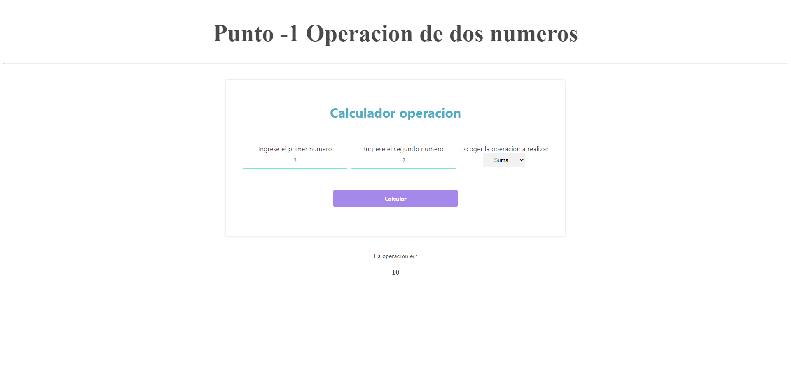
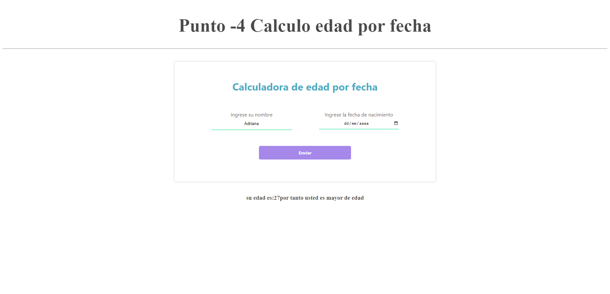

<h1>Taller 10: Adriana Vasquez Varon</h1>

<h2>Información</h2>

Curso: Full Stack Basico - Grupo 1 

Profesor: Cristian Patiño 

<h2>Punto 1</h2>

<h2>Punto 2: </h2>

<h2>Punto 3: </h2>

<h2>Punto 4: </h2>

<h2>Punto 5-6-7: Parrafos</h2>
<h3>5-Base de datos</h3>

<h3>6-Conexion base de datos</h3>

<h3>7- base de datos</h3>

